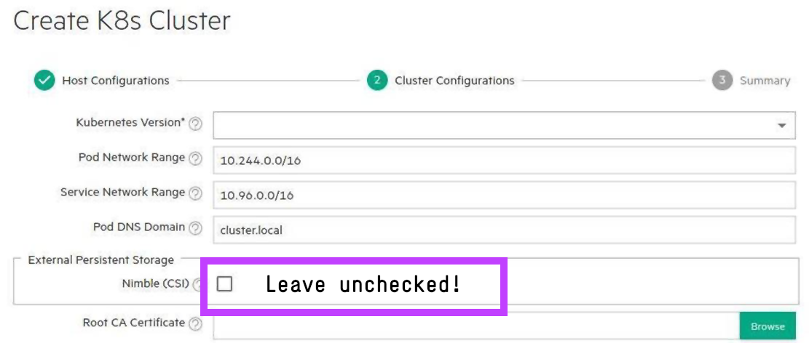

# Introduction

HPE Ezmeral Runtime Enterprise deploys and manages open source upstream Kubernetes clusters through its management console. It's also capable of importing foreign Kubernetes clusters. This guide describes the necessary steps to perform a successful deployment of the HPE CSI Driver for Kubernetes on HPE Ezmeral Runtime Enterprise managed clusters.

## Prerequisites

It's up to the HPE Ezmeral Runtime Enterprise administrator who deploys Kubernetes clusters to ensure that the particular version of the CSI driver (i.e v2.0.0) is supported with the following components.

- HPE Ezmeral Runtime Enterprise worker node host operating system
- HPE Ezmeral Runtime Enterprise deployed Kubernetes cluster version

Examine the table found in the [Compatibility and Support](../../index.md#compatibility_and_support) section of the CSI driver overview. Particular [Container Storage Providers](../../container_storage_provider/index.md) may have additional prerequisites.

### Version 5.4.0 and later

In Ezmeral 5.4.0 and later, an exception has been added to the "hpe-storage" `Namespace`. Proceed to [Installation](#installation) and disregard any steps outlined in this guide.

!!! note
    If the HPE CSI Driver built-in NFS Server Provisioner will be used, an exception needs to be granted to the "hpe-nfs" `Namespace`.<br/><br/>Run:<br/> `kubectl patch --type json -p '[{"op": "add", "path": "/spec/match/excludedNamespaces/-", "value": "hpe-nfs"}]' k8spspprivilegedcontainer.constraints.gatekeeper.sh/psp-privileged-container`

### Version 5.3.0

The CSI driver needs privileged access to the worker nodes to attach and detach storage devices. By default, an admission controller prevents all user deployed workloads access to the host filesystem. An exception needs to be created for the "hpe-storage" `Namespace`.

As a Kubernetes cluster admin, run the following.

```text
kubectl create ns hpe-storage
kubectl patch --type json -p '[{"op":"add","path":"/spec/unrestrictedFsMountNamespaces/-","value":"hpe-storage"}]' hpecpconfigs/hpecp-global-config -n hpecp
```

!!! caution
    In theory you may use any `Namespace` name desired. This might change in a future release and it's encouraged to use "hpe-storage" for compatibility with upcoming releases of HPE Ezmeral Runtime Enterprise.

By not performing this configuration change, the following events will be seen on the CSI controller `ReplicaSet` or CSI node `DaemonSet` trying to schedule `Pods`.

```text
Events:
  Type     Reason        Age                    From                   Message
  ----     ------        ----                   ----                   -------
  Warning  FailedCreate  2m4s (x17 over 7m32s)  replicaset-controller  Error creating: admission webhook "soft-validate.hpecp.hpe.com" denied the request: Hostpath ("/") referenced in volume is not valid for this namespace because of FS Mount protections.
```

### Version 5.2.0 or earlier

Early versions of HPE Ezmeral Runtime Enterprise (HPE Container Platform, HPE Ezmeral Container Platform) contained a checkbox to deploy the HPE CSI Driver for Kubernetes. This method is not supported. Make sure clusters are deployed without the checkbox ticked.



Continue with [Installation](#installation).

## Installation

Any method to install the HPE CSI Driver for Kubernetes on an HPE Ezmeral Runtime Enterprise managed Kubernetes cluster is supported. Helm is strongly recommended. Make sure to deploy the CSI driver to the "hpe-storage" `Namespace` for future compatibility.

- HPE CSI Driver for Kubernetes Helm chart on [Artifact Hub](https://artifacthub.io/packages/helm/hpe-storage/hpe-csi-driver) (recommended)
- HPE CSI Operator for Kubernetes on [OperatorHub.io](https://operatorhub.io/operator/hpe-csi-operator)
- [Advanced Install](../../deployment.md#advanced_install) using YAML manifests

!!! Important
    In some deployments of Ezmeral the kubelet root has been relocated, in those circumstances you'll see errors similar to: `Error: command mount failed with rc=32 err=mount: /dev/mapper/mpathh is already mounted or /var/lib/docker/kubelet/plugins/hpe.com/mounts/pvc-uuid busy /dev/mapper/mpathh is already mounted on /var/lib/docker/kubelet/plugins/hpe.com/mounts/pvc-uuid`. In this case it's recommended to install the CSI driver using Helm with the `--set kubeletRootDir=/var/lib/docker/kubelet` parameter.
