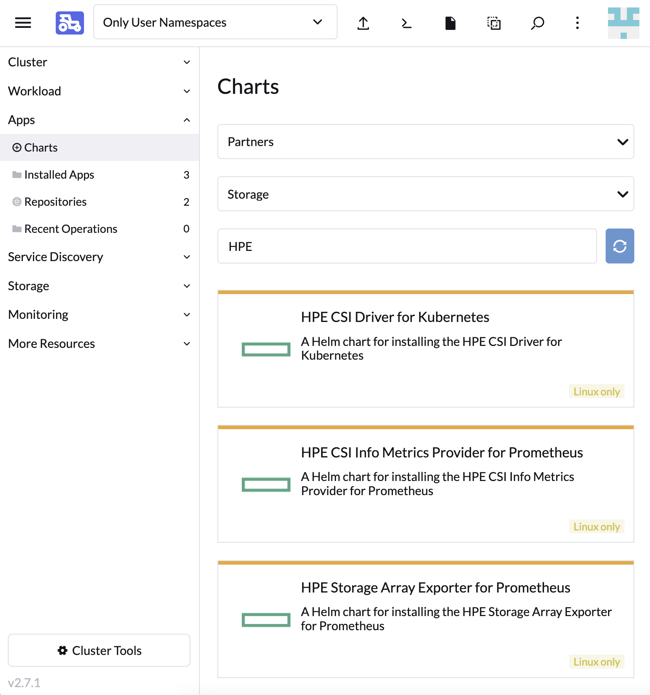

# Overview

SUSE Rancher provides a platform to deploy Kubernetes-as-a-service everywhere. HPE partners with SUSE Rancher to provide effortless management of the CSI driver on managed Kubernetes clusters. This allows our joint customers and channel partners to enable hybrid cloud stateful workloads on Kubernetes.

[TOC]

## Deployment considerations

Rancher is capable of managing Kubernetes across a broad spectrum of managed and BYO clusters. It's important to understand that the HPE CSI Driver for Kubernetes does not support the same amount of combinations Rancher does. Consult the support matrix on [the CSI driver overview page](../../index.md#compatibility_and_support) for the supported combinations of the HPE CSI Driver, Kubernetes and supported node operating systems.

## Supported versions

Rancher uses Helm to deploy and manage partner software. The concept of a Helm repository in Rancher is organized under "Apps" in the Rancher UI. The HPE CSI Driver for Kubernetes is a partner solution present in the official Partner repository.

| Rancher release | Install methods                       | Recommended CSI driver |
| --------------- | ------------------------------------- | ---------------------- |
| 2.7             | Cluster Manager App Chart             | latest                 |
| 2.8             | Cluster Manager App Chart             | latest                 |

!!! tip
    Learn more about Helm Charts and Apps in the [Rancher documentation](https://ranchermanager.docs.rancher.com/how-to-guides/new-user-guides/helm-charts-in-rancher)

### HPE CSI Driver for Kubernetes

The HPE CSI Driver is part of the official Partner repository in Rancher. The CSI driver is deployed on managed Kubernetes clusters like any ordinary "App" in Rancher.

!!! note
    In Rancher 2.5 an "Apps & Marketplace" component was introduced in the new "Cluster Explorer" interface. This is the new interface moving forward. Upcoming releases of the HPE CSI Driver for Kubernetes will only support installation via "Apps & Marketplace".

#### Rancher Cluster Manager (2.6 and newer)

Navigate to "Apps" and select "Charts", search for "HPE".

<small>Rancher Cluster Explorer</small>

### Post install steps

For Rancher workloads to make use of persistent storage from HPE, a supported backend needs to be configured with a `Secret` along with a `StorageClass`. These procedures are generic regardless of Kubernetes distribution and install method being used.

- Go ahead and [add an HPE storage backend](../../deployment.md#add_an_hpe_storage_backend)

### Ancillary HPE Storage Apps

Introduced in Rancher v2.7 and HPE CSI Driver for Kubernetes v2.3.0 is the ability to deploy the [HPE Storage Array Exporter for Prometheus](https://hpe-storage.github.io/array-exporter/) and [HPE CSI Info Metrics Provider for Prometheus](../../metrics.md) directly from the same Rancher Apps interface. These Helm charts have been enhanced to include support for Rancher Monitoring.

!!! tip
    Make sure to tick "Enable ServiceMonitor" in the "ServiceMonitor settings" when configuring the ancillary Prometheus apps to work with Rancher Monitoring.
