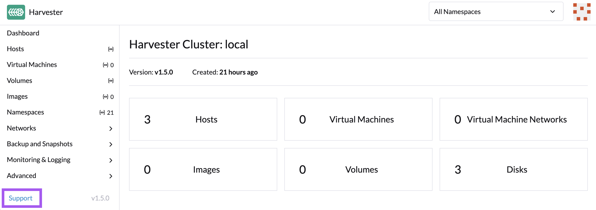
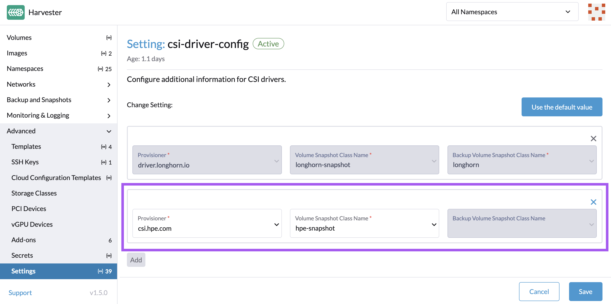

# Overview


*"Harvester is a modern hyperconverged infrastructure (HCI) solution built for bare metal servers using enterprise-grade open-source technologies including Linux, KVM, Kubernetes, KubeVirt, and Longhorn. Designed for users looking for a flexible and affordable solution to run cloud-native and virtual machine (VM) workloads in your datacenter and at the edge, Harvester provides a single pane of glass for virtualization and cloud-native workload management."*<sup>1</sup>

<div align="right"><small><sup>1</sup> = quote from <a href="https://harvesterhci.io/">HarvesterHCI.io</a>.</small></div>
<br/>

[TOC]

## Supportability

HPE supports the underlying host OS, SLE Micro, using the HPE CSI Driver for Kubernetes and the Rancher Kubernetes Engine 2 (RKE2) which is a CNCF certified Kubernetes distribution. SUSE Virtualization (formerly Harvester) embeds KubeVirt and uses standard CSI storage constructs to manage storage resources for virtual machines.

- Learn more about [Compatibility & Support](../../../csi_driver/index.html#compatibility_and_support)

!!! note
    The SCOD documentation refers to SUSE Virtualization as Harvester.

## Deployment Considerations

Many of the features provided by Harvester stem from the capabilities of KubeVirt. The HPE CSI Driver for Kubernetes provides "ReadWriteMany" block storage which allows seamless migration of VMs between hosts with disks attached. The NFS Server Provisioner may be used by disparate VMs that needs "ReadWriteMany" to share data.

## Limitations

These limitatons are framed around the integration of the HPE CSI Driver for Kubernetes and Harvester. Other limitations may apply.

### iSCSI Networking

As per best practice HPE recommends using dedicated iSCSI networks for data traffic between the Harvester nodes and the storage platform.

Ancillary network configuration of Harvester nodes is managed as a post-install step. Creating network configuration files for Harvester nodes is beyond the scope of this document. Follow the guides provided by Harvester.

- [Update Harvester Configuration After Installation](https://docs.harvesterhci.io/v1.5/install/update-harvester-configuration)

#### Example iSCSI Configuration

In a typical setup the IP addresses are assigned by DHCP on the NIC directly without any bridges, VLANs or bonds. Network interface configuration on Harvester are part of the node boot strap process post-install. Create the file `/oem/89_hpe-csi-iscsi.yaml` described below on each compute node to reflect a typical configuration.

```text
name: HPE CSI Driver for Kubernetes iSCSI configuration
stages:
  initramfs:
    - commands: []
      files:
        - path: /etc/sysconfig/network/ifcfg-ens1f1
          permissions: 384
          owner: 0
          group: 0
          content: |
            STARTMODE='onboot'
            BOOTPROTO='dhcp'
            DHCLIENT_SET_DEFAULT_ROUTE='no'
          encoding: ""
          ownerstring: ""
        - path: /etc/sysconfig/network/ifcfg-ens1f0
          permissions: 384
          owner: 0
          group: 0
          content: |
            STARTMODE='onboot'
            BOOTPROTO='dhcp'
            DHCLIENT_SET_DEFAULT_ROUTE='no'
          encoding: ""
          ownerstring: ""
```
!!! tip
    Replace the interface names `ens1f0` and `ens1f1` with the actual interface names on your compute nodes. List the available interfaces on the compute node prompt with `ip link`.

Reboot the node and verify that IP addresses have been assigned to the NICs by running `ip addr show dev <interface name>` on the compute node prompt.

- Learn more about [Harvester networking](https://docs.harvesterhci.io/v1.5/networking/index) in the official docs.

## Installing HPE CSI Driver for Kubernetes

The HPE CSI Driver for Kubernetes is installed on Harvester by using the standard procedures for [installing the CSI driver with Helm](../../deployment.md#helm). Helm require access to the Harvester cluster through the Kubernetes API. You can download the Harvester cluster KubeConfig file by visiting the dashboard on your cluster and click "support" in the lower left corner of the UI.



!!! note
    It does not matter if Harvester is managed by Rancher or running standalone. If the cluster is managed by Rancher, then go to the Virtualization Management dashboard and select "Download KubeConfig" in the dotted context menu of the cluster.

Once the CSI driver is installed, make sure to go through the next steps to [Configure Resources](#configure_resources).

## Configure Resources 

In order to upload images, boot VMs and attach data volumes from a HPE storage backend, a `StorageClass` and `Secret` needs to be configured. These steps are outlined in the [deployment section](../../../csi_driver/deployment.html#add_an_hpe_storage_backend) on SCOD.

!!! note
    Booting VMs from a HPE CSI Driver backed volume requires Harvester 1.5.0 or newer.

### Using VM snapshots

A `VolumeSnapshotClass` needs to be created for the HPE CSI Driver in order to be able to create VM and volume snapshots. Follow the example on the [Using](../../../csi_driver/using.md#using_csi_snapshots) page.

!!! tip
    The external snapshotter is already installed by Harvester. Only a `VolumeSnapshotClass` is needed.

Next, for the Harvester control-plane to recognize the `VolumeSnapshotClass` to be used for the "csi.hpe.com" CSI driver prefix, bring up the "Advanced -> Settings" panel and create the mapping as illustrated below.



Harvester is now ready for use with HPE CSI Driver for Kubernetes.
