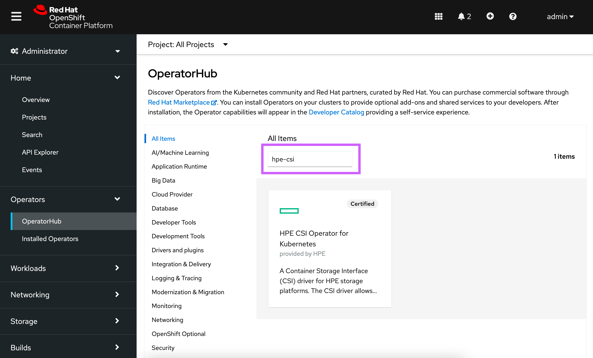
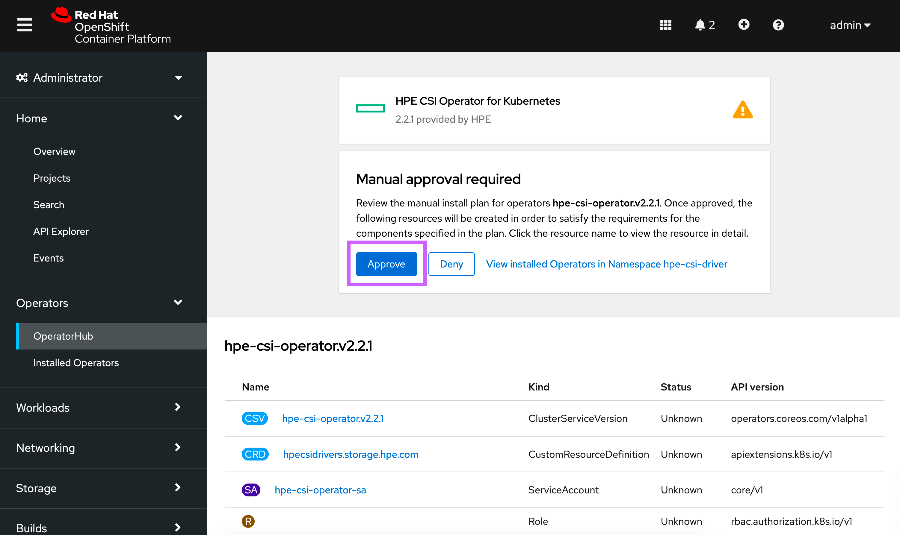

# Overview
HPE and Red Hat have a long standing partnership to provide jointly supported software, platform and services with the absolute best customer experience in the industry.

Red Hat OpenShift uses open source Kubernetes and various other components to deliver a PaaS experience that benefits both developers and operations. This packaged experience differs slightly on how you would deploy and use the HPE volume drivers and this page serves as the authoritative source for all things HPE primary storage and Red Hat OpenShift.

[TOC]

## OpenShift 4

Software deployed on OpenShift 4 follows the [Operator pattern](https://kubernetes.io/docs/concepts/extend-kubernetes/operator/). CSI drivers are no exception.

### Certified combinations

Software delivered through the HPE and Red Hat partnership follows a rigorous certification process and only qualify what's listed in the following table.

| Status                  | Red Hat OpenShift                 | HPE CSI Operator           | Container Storage Providers          |
| ----------------------- | --------------------------------- | -------------------------- | ------------------------------------ |
| Certified               | 4.10 EUS<sup>3</sup>              | 2.2.1                      | [All](../../container_storage_provider/index.md) |
| Uncertified<sup>2</sup> | 4.9 (Upgrade path only)           | -                          | -                                    |
| Certified               | 4.8 EUS<sup>3</sup>               | 2.1.3<sup>4</sup>, 2.2.1               | [All](../../container_storage_provider/index.md) |
| Uncertified<sup>2</sup> | 4.7 (Upgrade path only)           | -                          | -                                    |
| Certified               | 4.6 EUS<sup>3</sup>               | 1.4.0<sup>4</sup>, 2.0.0<sup>4</sup>, 2.1.3<sup>4</sup> | [All](../../container_storage_provider/index.md) |

<small><sup>1</sup> = End of life support per [Red Hat OpenShift Life Cycle Policy](https://access.redhat.com/support/policy/updates/openshift).</small><br />
<small><sup>2</sup> = HPE will only be certifying the HPE CSI Operator for Kubernetes on **EVEN** versions of Red Hat OpenShift (i.e. 4.4, 4.6, etc). The Operator will not go through the Red Hat certification process for **MIDDLE** releases (i.e. 4.5, 4.7, etc.) and will only be supported as upgrade path to the next **EVEN** release of Red Hat OpenShift.</small><br />
<small><sup>3</sup> = Red Hat OpenShift [Extended Update Support](https://access.redhat.com/support/policy/updates/openshift-eus).</small></br />
<small><sup>4</sup> = This version is currently uninstallable.</small>

Check this table periodically for future releases.

!!! seealso "Pointers"
    - Other combinations may work but will not be supported.
    - Both Red Hat Enterprise Linux and Red Hat CoreOS worker nodes are supported.
    - Instructions on this page only reflect the current version of the CSI Operator and OpenShift.

### Security model

By default, OpenShift prevents containers from running as root. Containers are run using an arbitrarily assigned user ID. Due to these security restrictions, containers that run on Docker and Kubernetes might not run successfully on Red Hat OpenShift without modification. 

Users deploying applications that require persistent storage (i.e. through the HPE CSI Driver) will need the appropriate permissions and Security Context Constraints (SCC) to be able to request and manage storage through OpenShift. Modifying container security to work with OpenShift is outside the scope of this document.

For more information on OpenShift security, see [Managing security context constraints](https://docs.openshift.com/container-platform/4.6/authentication/managing-security-context-constraints.html).

!!! note
    If you run into issues writing to persistent volumes provisioned by the HPE CSI Driver under a restricted SCC, add the `fsMode: "0770"` parameter to the `StorageClass` with RWO claims or `fsMode: "0777"` for RWX claims.

### Limitations

Since the CSI Operator only provides "Basic Install" capabilities. The following limitations apply:

- The `ConfigMap` "hpe-linux-config" that controls host configuration is immutable

### Deployment

The HPE CSI Operator for Kubernetes needs to be installed through the interfaces provided by Red Hat. Do not follow the instructions found on OperatorHub.io. 

!!! tip
    There's a tutorial available on YouTube accessible through the [Video Gallery](../../learn/video_gallery/index.md#install_the_hpe_csi_operator_for_kubernetes_on_red_hat_openshift) on how to install and use the HPE CSI Operator on Red Hat OpenShift. 

#### Upgrading

In situations where the operator needs to be upgraded, follow the prerequisite steps in the Helm chart on Artifact Hub.

- [Upgrading the chart](https://artifacthub.io/packages/helm/hpe-storage/hpe-csi-driver#upgrading-the-chart)

!!! danger "Automatic Updates"
    Do not under any circumstance enable "Automatic Updates" for the HPE CSI Operator for Kubernetes

Once the steps have been followed for the particular version transition:

- Uninstall the `HPECSIDriver` instance
- Delete the "hpecsidrivers.storage.hpe.com" `CRD`<br />:
  `oc delete crd/hpecsidrivers.storage.hpe.com`
- [Uninstall](#uninstall_the_hpe_csi_operator) the HPE CSI Operator for Kubernetes
- Proceed to installation through the [OpenShift Web Console](#openshift_web_console) or [OpenShift CLI](#openshift_cli)

!!! important "Good to know"
    Deleting the `HPECSIDriver` instance and uninstalling the CSI Operator does not affect any running workloads, `PersistentVolumeClaims`, `StorageClasses` or other API resources created by the CSI Operator. In-flight operations and new requests will be retried once the new `HPECSIDriver` has been instantiated.

#### Prerequisites

The HPE CSI Driver needs to run in privileged mode and needs access to host ports, host network and should be able to mount hostPath volumes. Hence, before deploying HPE CSI Operator on OpenShift, please create the following `SecurityContextConstraints` (SCC) to allow the CSI driver to be running with these privileges.

Download the SCC to where you have access to `oc` and the OpenShift cluster:

```text
curl -sL https://raw.githubusercontent.com/hpe-storage/co-deployments/master/operators/hpe-csi-operator/deploy/scc.yaml > hpe-csi-scc.yaml
```

Change `my-hpe-csi-operator` to the name of the project (e.g. `hpe-csi-driver` below) where the CSI Operator is being deployed.

```text
oc new-project hpe-csi-driver --display-name="HPE CSI Driver for Kubernetes"
sed -i'' -e 's/my-hpe-csi-driver-operator/hpe-csi-driver/g' hpe-csi-scc.yaml
```

Deploy the SCC:

```text
oc create -f hpe-csi-scc.yaml
securitycontextconstraints.security.openshift.io/hpe-csi-scc created
```

!!! important
    Make note of the project name as it's needed for the Operator deployment in the next steps.

#### OpenShift web console

Once the SCC has been applied to the project, login to the OpenShift web console as `kube:admin` and navigate to **Operators -> OperatorHub**.


*Search for 'HPE CSI' in the search field and select the non-marketplace version.*


*Click 'Install'.*


*Select the Namespace where the SCC was applied, select 'Manual' Update Approval, click 'Install'.*


*Click 'Approve' to finalize installation of the Operator*


*The HPE CSI Operator is now installed, select 'View Operator'.*


*Click 'Create Instance'.*


*Normally, no customizations are needed, click 'Create'.*

By navigating to the Developer view, it should now be possible to inspect the CSI driver and Operator topology.


The CSI driver is now ready for use. Next, an [HPE storage backend needs to be added](../../csi_driver/deployment.md#add_an_hpe_storage_backend) along with a [`StorageClass`](../../csi_driver/using.md#base_storageclass_parameter).

See [Caveats](#caveats) below for information on creating `StorageClasses` in Red Hat OpenShift.

#### OpenShift CLI

This provides an example Operator deployment using `oc`. If you want to use the web console, proceed to the [previous section](#openshift_web_console).

It's assumed the SCC has been applied to the project and have `kube:admin` privileges. As an example, we'll deploy to the `hpe-csi-driver` project as described in previous steps.

First, an `OperatorGroup` needs to be created.

```yaml
apiVersion: operators.coreos.com/v1
kind: OperatorGroup
metadata:
  name: hpe-csi-driver-for-kubernetes
  namespace: hpe-csi-driver
spec:
  targetNamespaces:
  - hpe-csi-driver
```

Next, create a `Subscription` to the Operator.

```yaml
apiVersion: operators.coreos.com/v1alpha1
kind: Subscription
metadata:
  name: hpe-csi-operator
  namespace: hpe-csi-driver
spec:
  channel: stable
  installPlanApproval: Manual
  name: hpe-csi-operator
  source: certified-operators
  sourceNamespace: openshift-marketplace
```

Next, approve the installation.

```text
oc -n hpe-csi-driver patch $(oc get installplans -n hpe-csi-driver -o name) -p '{"spec":{"approved":true}}' --type merge
```

The Operator will now be installed on the OpenShift cluster. Before instantiating a CSI driver, watch the roll-out of the Operator.

```text
oc rollout status deploy/hpe-csi-driver-operator -n hpe-csi-driver
Waiting for deployment "hpe-csi-driver-operator" rollout to finish: 0 of 1 updated replicas are available...
deployment "hpe-csi-driver-operator" successfully rolled out
```

The next step is to create a `HPECSIDriver` object.

```yaml
```

The CSI driver is now ready for use. Next, an [HPE storage backend needs to be added](../../csi_driver/deployment.md#add_an_hpe_storage_backend) along with a [`StorageClass`](../../csi_driver/using.md#base_storageclass_parameter).

#### Additional information

At this point the CSI driver is managed like any other Operator on Kubernetes and the life-cycle management capabilities may be explored further in the [official Red Hat OpenShift documentation](https://docs.openshift.com/container-platform/4.3/operators/olm-what-operators-are.html).

#### Uninstall the HPE CSI Operator

When uninstalling an operator managed by OLM, a Cluster Admin must decide whether or not to remove the `CustomResourceDefinitions` (CRD), `APIServices`, and resources related to these types owned by the operator. By design, when OLM uninstalls an operator it does not remove any of the operator’s owned `CRDs`, `APIServices`, or `CRs` in order to prevent data loss.

!!! important
    Do not modify or remove these `CRDs` or `APIServices` if you are upgrading or reinstalling the HPE CSI driver in order to prevent data loss.

The following are `CRDs` installed by the HPE CSI driver.

```text
hpecsidrivers.storage.hpe.com
hpenodeinfos.storage.hpe.com
hpereplicationdeviceinfos.storage.hpe.com
hpesnapshotgroupinfos.storage.hpe.com
hpevolumegroupinfos.storage.hpe.com
hpevolumeinfos.storage.hpe.com
snapshotgroupclasses.storage.hpe.com
snapshotgroupcontents.storage.hpe.com
snapshotgroups.storage.hpe.com
volumegroupclasses.storage.hpe.com
volumegroupcontents.storage.hpe.com
volumegroups.storage.hpe.com
```

The following are `APIServices` installed by the HPE CSI driver.

```text
v1.storage.hpe.com
v2.storage.hpe.com
```

Please refer to the OLM Lifecycle Manager documentation on how to safely [Uninstall your operator](https://olm.operatorframework.io/docs/tasks/uninstall-operator/).
