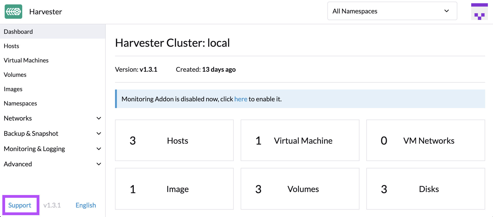

# Overview

*"Harvester is a modern hyperconverged infrastructure (HCI) solution built for bare metal servers using enterprise-grade open-source technologies including Linux, KVM, Kubernetes, KubeVirt, and Longhorn. Designed for users looking for a flexible and affordable solution to run cloud-native and virtual machine (VM) workloads in your datacenter and at the edge, Harvester provides a single pane of glass for virtualization and cloud-native workload management."*<sup>1</sup>

<div align="right"><small><sup>1</sup> = quote from <a href="https://harvesterhci.io/">HarvesterHCI.io</a>.</small></div>
<br/>

HPE supports the underlying host OS, SLE Micro, using the HPE CSI Driver for Kubernetes and the Rancher Kubernetes Engine 2 (RKE2) which is a CNCF certified Kubernetes distribution. Harvester embeds KubeVirt and uses standard CSI storage contructs to manage storage resoruces for virtual machines.

[TOC]

## Deployment Considerations

Many of the features provided by Harvester stem from the capabilities of KubeVirt. The HPE CSI Driver for Kubernetes provides "ReadWriteMany" block storage which allows seamless migration of VMs between hosts with disks attached. The NFS Server Provisioner may be used by disparate VMs that needs "ReadWriteMany" to share data.

## Limitations

These limitatons are framed around the integration of the HPE CSI Driver for Kubernetes and Harvester. Other limitations may apply.

### Boot from Longhorn

Since Harvester is a hyper-converged infrastructure platform in its own right, the storage components are already embedded in the platform using Longhorn. Longhorn is designed to run from local server storage and today it's not practical to replace Longhorn with CSI capable storage from HPE. The Harvester servers may use boot from SAN and other means in terms of external storage to provide capacity to Longhorn but Longhorn would still be used to create VM images and machines.

Storage provided by platforms supported by the HPE CSI Driver for Kubernetes is complementary and non-boot disks may be easily provisioned and attached to VM workloads.

!!! info
    The VM boot limitation is solely implemented by Harvester in front of KubeVirt. Any other KubeVirt platform would allow booting from storage resources provided by HPE CSI Driver for Kubernetes.

### iSCSI Networking

As per best practice HPE recommends using dedicated iSCSI networks for data traffic between the Harvester nodes and the storage platform.

Ancillary network configuration of Harvester nodes is managed as a post-install step. Creating network configuration files for Harvester nodes is beyond the scope of this document. Follow the guides provided by Harvester.

- [Update Harvester Configuration After Installation](https://docs.harvesterhci.io/v1.3/install/update-harvester-configuration)

#### Example iSCSI Configuration

In a typical setup the IP addresses are assigned by DHCP on the NIC directly without any bridges, VLANs or bonds. The updates that needs to be done to `/oem/90_custom.yaml` on each compute node to reflect this configuration are described below.

Insert the block after the management interface configuration and replace the interface names `ens224` and `ens256` with the actual interface names on your compute nodes. List the available interfaces on the compute node prompt with `ip link`.

```text
            ...
            - path: /etc/sysconfig/network/ifcfg-ens224
              permissions: 384
              owner: 0
              group: 0
              content: |
                STARTMODE='onboot'
                BOOTPROTO='dhcp'
                DHCLIENT_SET_DEFAULT_ROUTE='no'
              encoding: ""
              ownerstring: ""
            - path: /etc/sysconfig/network/ifcfg-ens256
              permissions: 384
              owner: 0
              group: 0
              content: |
                STARTMODE='onboot'
                BOOTPROTO='dhcp'
                DHCLIENT_SET_DEFAULT_ROUTE='no'
              encoding: ""
              ownerstring: ""
              ...
```

Reboot the node and verify that IP addresses have been assigned to the NICs by running `ip addr show dev <interface name>` on the compute node prompt.

## Installing HPE CSI Driver for Kubernetes

The HPE CSI Driver for Kubernetes is installed on Harvester by using the standard procedures for [installing the CSI driver with Helm](../../csi_driver/deployment.md#helm). Helm require access to the Harvester cluster through the Kubernetes API. You can download the Harvester cluster KubeConfig file by visiting the dashboard on your cluster and click "support" in the lower left corner of the UI.



!!! note
    It does not matter if Harvester is managed by Rancher or running standalone. If the cluster is managed by Rancher, then go to the Virtualization Management dashboard and select "Download KubeConfig" in the dotted context menu of the cluster.
